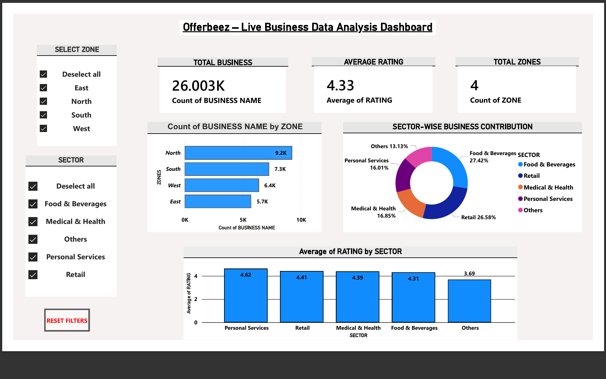

# 📊 Offerbeez Business Data Analysis

## 📌 Project Overview
Conducted end-to-end data analysis on large-scale business listing data using **Python** and **Power BI**. Performed data cleaning, transformation, and **exploratory data analysis (EDA)** to identify zone-wise and sector-wise performance trends. Designed an **interactive Power BI dashboard** with KPIs, slicers, and visual insights to monitor business distribution and customer ratings. Generated actionable insights to support **strategic decision-making and business growth**.

---

## 🏢 Business Problem
- No centralized analytics view of business listing data  
- Limited visibility into zone-wise and sector-wise business performance  
- Difficulty analyzing customer ratings and service quality trends  
- Manual analysis restricting data-driven business decisions  
- Need for an interactive dashboard to support strategic planning  

---

## 📂 Dataset
- Business listing dataset containing **~26,000 records**  
- Key attributes: business name, zone, sector, rating, and location details  
- Data sourced from **live business listings (Offerbeez platform)**  
- Includes multiple sectors such as **Food & Beverages, Retail, Medical & Health, and Services**  
- Dataset used for zone-wise, sector-wise, and rating-based analysis  

### Dataset Files
- `zone_counts.csv` – zone-wise business distribution  
- `sector_counts.csv` – sector-wise business contribution  
- `category_counts.csv` – category-level analysis  
- `top_rated_20.csv` – top-rated businesses  
- `low_rated_20.csv` – low-rated businesses  
- `pin_counts.csv` – pincode-level density analysis  
- `zone_clusters.csv` – zone clustering insights  

---

## 🛠️ Tools & Technologies
- **Python** – data cleaning, preprocessing, and exploratory data analysis  
- **Pandas & NumPy** – data manipulation and transformation  
- **Jupyter Notebook** – analysis and documentation  
- **Power BI** – interactive dashboard creation and data visualization  
- **DAX** – KPI calculations and business metrics  
- **Microsoft Excel** – initial data review and validation  

---

## 🗂️ Project Structure
```
Offerbeez-Business-Data-Analysis/
│
├── data/
│   ├── zone_counts.csv
│   ├── sector_counts.csv
│   ├── category_counts.csv
│   ├── top_rated_20.csv
│   ├── low_rated_20.csv
│   ├── pin_counts.csv
│   └── zone_clusters.csv
│
├── notebooks/
│   └── Offerbeez Analysis.ipynb
│
├── dashboard/
│   └── offerbeez_dashboard.pdf
│
├── reports/
│   └── offerbeez_dashboard.png
│
└── README.md
```

---

## 🧹 Data Cleaning & Preparation
- Handled missing and null values to improve data quality  
- Removed duplicate business records for accurate analysis  
- Standardized zone and sector names for consistency  
- Cleaned and validated rating values to avoid calculation errors  
- Prepared final dataset optimized for analysis and visualization  

---

## 🔍 Exploratory Data Analysis (EDA)
- Analyzed zone-wise distribution of businesses to identify regional concentration  
- Examined sector-wise contribution to identify dominant business categories  
- Evaluated customer rating trends across sectors and zones  
- Identified high-performing and low-performing sectors  
- Used visual summaries to uncover patterns, trends, and outliers  

---

## ❓ Research Questions
- How are businesses distributed across different zones?  
- Which sectors contribute the most to total business listings?  
- How do customer ratings vary by sector and zone?  
- Which business categories show high and low performance?  

---

## 📈 Key Findings
- North and South zones have the highest concentration of businesses  
- Food & Beverages and Retail dominate overall business listings  
- Personal Services sector shows the highest average customer rating  
- Overall customer satisfaction remains high across most sectors  

---

## 📊 Dashboard
- Developed an interactive **Power BI dashboard** for business performance analysis  
- Displayed KPIs: **Total Businesses, Average Rating, Total Zones**  
- Enabled zone-wise and sector-wise filtering using slicers  
- Visualized business distribution and rating trends using charts  
- Included a **Reset Filters** option for improved user experience  

### 📄 Dashboard File
👉 Click to open:  
[View Power BI Dashboard PDF](dashboard/offerbeez_dashboard.pdf)

### 🖼️ Dashboard Preview


---

## ▶️ How to Run This Project
1. Clone or download this repository  
2. Open `notebooks/Offerbeez Analysis.ipynb` using **Jupyter Notebook** or **JupyterLab**  
3. Install required Python libraries:
   ```bash
   pip install pandas numpy matplotlib seaborn
   ```
4. Run notebook cells sequentially to perform data cleaning and analysis  
5. Open the dashboard PDF using the link above  

---

## 📓 Notebook Preview (If GitHub doesn’t render)
[View Notebook on nbviewer](https://nbviewer.org/github/your-username/Offerbeez-Business-Data-Analysis/blob/main/notebooks/Offerbeez%20Analysis.ipynb)

---

## ⚠️ Limitations
- Analysis is based on a static snapshot of business listing data  
- Limited customer behavior and revenue-related attributes  
- Rating data may not capture detailed customer sentiment  
- External market and seasonal factors not included  

---

## 🚀 Future Scope
- Integrate real-time or periodically refreshed business data  
- Include customer reviews and sentiment analysis  
- Add revenue, sales, and engagement metrics  
- Automate data refresh and dashboard updates  
- Expand analysis to predictive and trend-based modeling  

---

## 👤 Author & Contact
- **Author:** Rehman Khan  
- **Degree:** Master of Computer Applications (MCA)  
- **Role Interest:** Data Analyst | Business Analyst  
- **Email:** rehman020219@gmail.com  
- **LinkedIn:** https://www.linkedin.com/in/rehman-khan1919  
- **GitHub:** https://github.com/your-username
